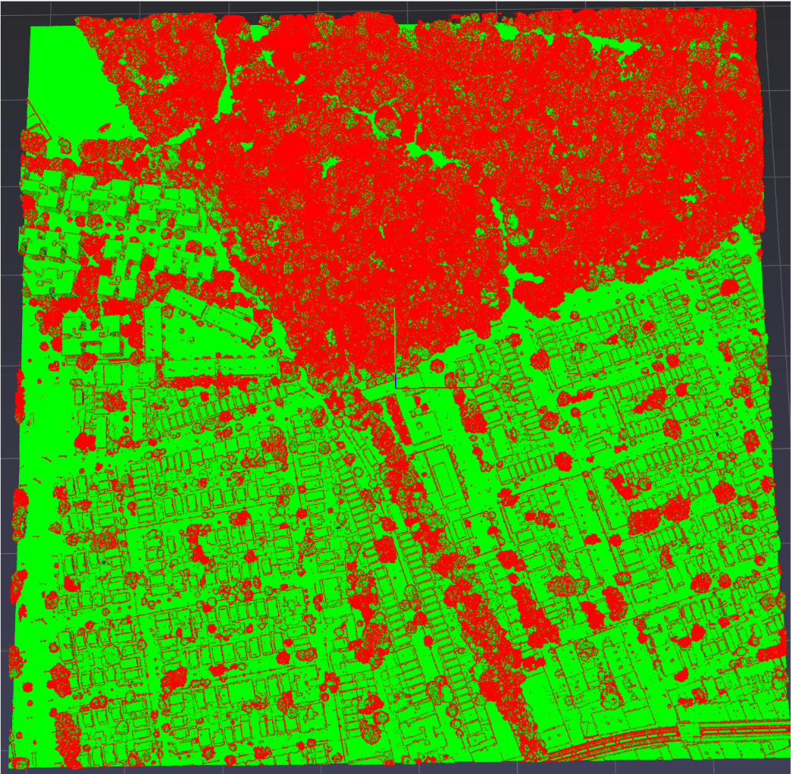
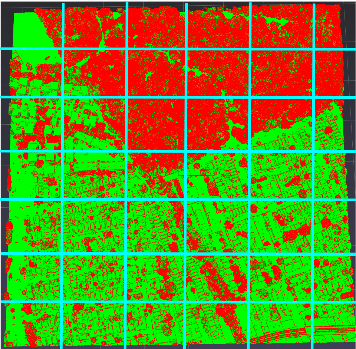
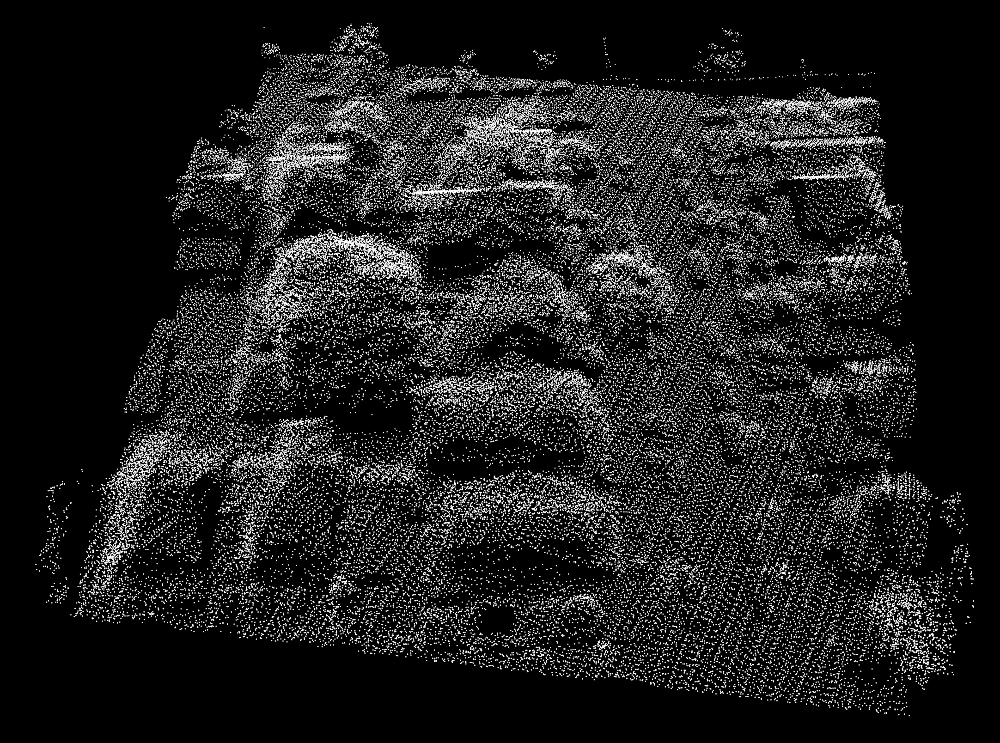
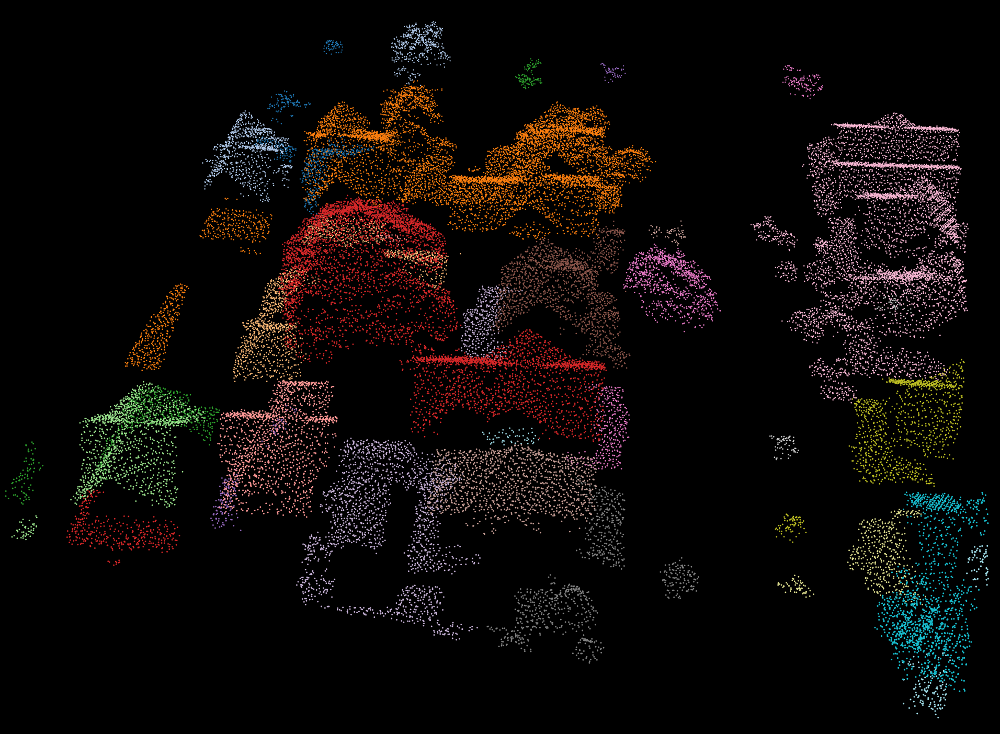
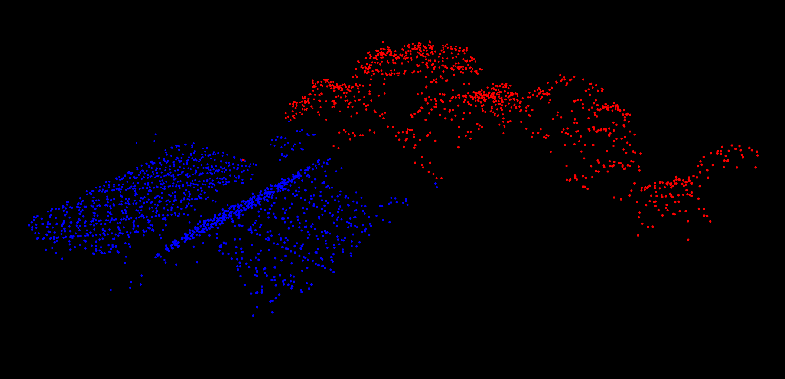
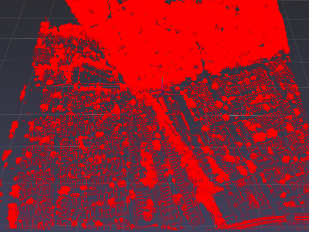
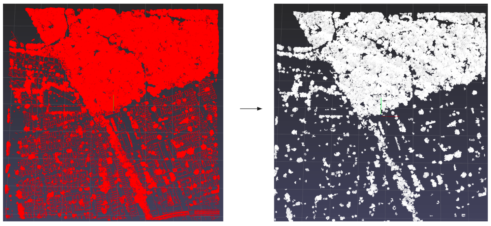

# Pre-Processing NYC lidar data

### We will be working with [2017 NYC topobathymetric LiDAR data](https://github.com/CityOfNewYork/nyc-geo-metadata/blob/master/Metadata/Metadata_TopobathymetricClassifiedPointCloud.md)

### You can find more information about las files [here](https://laspy.readthedocs.io/en/latest/intro.html)

***
## Reading a las file
```python
#Used to uniquely identify workflow files
las_filename = "25192"
#Used in filename to seperate lidar scans
las_file_year = 2015
#Path to where the raw <filename>.las is stored
las_file_path = "<path to file>"
#Store laspy file object
las_testfile = laspy.read(las_file_path)
```
***

## Basic manipulations on laspy file object
```python
#Get .las file Point Format Type
las_testfile.point_format.id
#Print total number of points
las_testfile.header.point_count
#Get raw classification label provided in .las file
las_testfile.classification
#Available dimensions in point format
list(las_testfile.header.point_format.dimension_names)
#Print X,Y,Z scale and offsets
las_testfile.header.scales, las_testfile.header.offsets
```

# Additional Resources 

[Classification Labels for NYC LiDAR data](https://github.com/CityOfNewYork/nyc-geo-metadata/blob/master/Metadata/Metadata_TopobathymetricClassifiedPointCloud.md)

Available data in lasfile object (Highlighted variables are used in analysis)

[<span style="color:red">'X'</span>,\
 <span style="color:red">'Y''</span>,\
 <span style="color:red">'Z''</span>,\
 'intensity',\
 <span style="color:red">'return_number''</span>,\
 <span style="color:red">'number_of_returns''</span>,\
 'synthetic',\
 'key_point',\
 'withheld',\
 'overlap',\
 'scanner_channel',\
 'scan_direction_flag',\
 'edge_of_flight_line',\
 <span style="color:red">'classification''</span>,\
 'user_data',\
 'scan_angle',\
 'point_source_id',\
 'gps_time']
 
<br>
<br>

# Create Lidar Dataframe
```python
#Making a datframe from the lidar data

Xscale = las_testfile.header.x_scale
Yscale = las_testfile.header.y_scale
Zscale = las_testfile.header.z_scale

Xoffset = las_testfile.header.x_offset
Yoffset = las_testfile.header.y_offset
Zoffset = las_testfile.header.z_offset

#Create numpy array of raw lidarPoints
##convert ft to m and correct measurement
lidarPoints = np.array(
    ( (las_testfile.X*Xscale)/3.28 + Xoffset, 
      (las_testfile.Y*Yscale)/3.28 + Yoffset,
      (las_testfile.Z*Zscale)/3.28 + Zoffset,
    las_testfile.classification,
    las_testfile.return_number, 
    las_testfile.number_of_returns)).transpose()

#Create a pandas dataframe from lidarPoints
lidar_df = pd.DataFrame(lidarPoints , columns=['X','Y','Z','classification','return_number','number_of_returns'])
```
# Raw points
```python
#Raw point cloud data
points = np.array((
    ((lidar_df.X)*(Xscale)))/3.28 + Xoffset, # convert ft to m
    (lidar_df.Y)*(Yscale))/3.28 + Yoffset, #convert ft to m
    (lidar_df.Z)*(Zscale))/3.28 + Zoffset
)).transpose()
```

*Note : Since the workflow contains multiple parameters which will be explained later on, changing metrics must be accompanied by adjustment of these parameters*

# Filter Lidar Dataframe based on Number of returns

```python
#Store a copy of original dataframe , used in sanity checks
lidar_df_copy = lidar_df
#Retain any points if the number of returns for that IR beam > 1
trees = lidar_df[lidar_df['number_of_returns'] - lidar_df['return_number'] > 0 ]
#Retain all other points , (number of returns cannot be nagative)
#NOTE: Building Dataframe includes Single Returns - Trees+Building+Ground
building = lidar_df[lidar_df['number_of_returns'] - lidar_df['return_number'] == 0 ]
#Individual Dataframes for explatory analysis of Data
returns1 = lidar_df[lidar_df['number_of_returns'] == 1 ]
returns2 = lidar_df[lidar_df['number_of_returns']== 2 ]
returns3 = lidar_df[lidar_df['number_of_returns']== 3 ]
returns4 = lidar_df[lidar_df['number_of_returns']== 4 ]
```

# Plotting Trees (Multiple Returns) and Building (Single Returns)

*We use pptk.viewer() to visualize and interact with 3d point clouds*

```python
# Sanity Check plotting (Tree + Building) 
FilteredTreePoints = np.array((
    ((trees.X)*(Xscale)) + Xoffset,
    (trees.Y)*(Yscale) + Yoffset,
    (trees.Z)*(Zscale) + Zoffset
)).transpose()

FilteredBuildingPoints = np.array((
    ((building.X)*(Xscale)) + Xoffset,
    (building.Y)*(Yscale) + Yoffset,
    (building.Z)*(Zscale) + Zoffset
)).transpose()

#Concatenate Tree and Building Points
Tree_and_BuildingPoints = np.concatenate((FilteredTreePoints, FilteredBuildingPoints), axis=0)
# Create a color array ([R,G,B]) for each Tree and Building point
rgb_Tree =  [[1,0,0]]*len(FilteredTreePoints) #Set red colour
rgb_Building = [[0,1,0]]*len(FilteredBuildingPoints) #set green colour
All_rgb = np.concatenate((rgb_Tree, rgb_Building), axis=0)

#Red - Tree Points
#Green - Building Points
pptk.viewer(Tree_and_BuildingPoints, All_rgb)
```


# Remove Noise Withheld Points 
**Points where las_testfile.classification == 7 in lasfile object**
```python
lidar_df = lidar_df[lidar_df["classification"] != 7]
trees_df = trees[trees["classification"] != 7]
building_df = building[building["classification"] != 7]
```

# Splitting LiDAR points into Tile subsets

```python
#Get tile limits
X_max , X_min = lidar_df.X.max(), lidar_df.X.min()
Y_max , Y_min = lidar_df.Y.max(), lidar_df.Y.min()

#Indicates the number of tiles you want to divide the tiles into
X_plane_tile_divisor = 7 # N tiles along X axis
Y_plane_tile_divisor = 6 # M tiles along Y axis
#NOTE: Generally N=M, (Unequal here for illustration only)

#Get total Length and Breadth of the tile
X_diff = X_max - X_min
Y_diff = Y_max - Y_min

#Store length of breadth of each smaller tileset
X_div_len = X_diff/X_plane_tile_divisor
Y_div_len = Y_diff/Y_plane_tile_divisor
```

You will notice the above script will be repeated across different stages of the codebase. Since the number of tiles is a hyper parameter, modifying it will showcase change in performance across the stages of the workflow which will be mentioned in the later sections


***
#### <p align="center">END OF PRE-PROCESSING STAGE </p>
***
<br><br>

# Overview Algorithms Used

## **RANSAC** - Random Sample Concensus

### ***RANSAC is very good at estimating Planes/Surfaces in point cloud***

<br>

*Below is a script you can run to quickly setup a plot, The code will be explained in the later sections*

```python
#Plotting Subset of lidar points

X_max , X_min = lidar_df.X.max(), lidar_df.X.min()
Y_max , Y_min = lidar_df.Y.max(), lidar_df.Y.min()

X_plane_tile_divisor = 10
Y_plane_tile_divisor = 10

X_diff = X_max - X_min
Y_diff = Y_max - Y_min

X_div_len = math.ceil(X_diff/X_plane_tile_divisor)
Y_div_len = math.ceil(Y_diff/Y_plane_tile_divisor)

#Select subset_tile - 2
x_cloud_subset_min = X_min + X_div_len
x_cloud_subset_max = X_min + 2*X_div_len
y_cloud_subset_min = Y_min + Y_div_len
y_cloud_subset_max = Y_min + 2*Y_div_len

#Create a subset df of points needed
lidar_subset_df = lidar_df[
    (lidar_df['X'].between(x_cloud_subset_min, x_cloud_subset_max, inclusive=False) &
lidar_df['Y'].between(y_cloud_subset_min, y_cloud_subset_max, inclusive=False))
]

#Take only X,Y,Z columns from lidar_df to plot
v = pptk.viewer(lidar_subset_df.iloc[:,:3])
v.set(show_grid=False)
v.set(show_axis=False)
v.set(bg_color = [0,0,0,0])
v.set(point_size = 0.04)
```

Slice of raw lidar points


<br>

```python
#Define Open3d Point Cloud Object - pcd
pcd = o3d.geometry.PointCloud()

points_lidar_subset = lidar_subset_df.iloc[:,:3] #take subset

#Assign points to point cloud object
pcd.points = o3d.utility.Vector3dVector(points_lidar_subset.to_numpy())

#Using Open3d implementation of RANSAC
plane_model, inliers = pcd.segment_plane(distance_threshold=1.5,
ransac_n=5,
num_iterations=600)

[a, b, c, d] = plane_model
print(f"Plane equation: {a:.2f}x + {b:.2f}y + {c:.2f}z + {d:.2f} = 0")

#getting outliers and inliers
inlier_cloud_object = pcd.select_by_index(inliers)
inlier_cloud_points = np.asarray(inlier_cloud_object.points)

outlier_cloud_object = pcd.select_by_index(inliers, invert=True)
outlier_cloud_points = np.asarray(outlier_cloud_object.points)

#plotting inlier and outlier

in_plus_out_points = np.concatenate((inlier_cloud_points, outlier_cloud_points), axis=0)
rgb_inliers =  [[1,0,0]]*len(inlier_cloud_points) #set inlier color to red
rgb_outliers = [[0,1,0]]*len(outlier_cloud_points)#set outlier color to green

#final color array for inlier and outleir
in_plus_out_rgb = np.concatenate((rgb_inliers, rgb_outliers), axis=0)

#Red - Inlier - ground plane , Green - Outlier
v = pptk.viewer(in_plus_out_points, in_plus_out_rgb)
v.set(show_grid=False)
v.set(show_axis=False)
v.set(bg_color = [0,0,0,0])
v.set(point_size = 0.04)

```
Using RANSAC to identify ground points


## **DBSCAN** - Density Based Spatial Clustering with Noise

### ***DBSCAN is very good at Seperating Various objects in a point cloud***

#### *Note in the following illustration, We have seperated the ground points using RANSAC and ran DBSCAN clustering on remaining points (Green points from previous figure)*

```python

#Generate DBSCAN labels from open3d implementation
labels = np.array(outlier_cloud_object.cluster_dbscan(eps=1.5, min_points=20))

#set colours for each label
max_label = labels.max()
colors = plt.get_cmap("tab20")(labels / (max_label 
if max_label > 0 else 1))
colors[labels < 0] = 0

#plot
v = pptk.viewer(outlier_cloud_points,colors[:,:3])
v.set(show_grid=False)
v.set(show_axis=False)
v.set(bg_color = [0,0,0,0])
v.set(point_size = 0.04)
```
Using DBSCAN to identify different clusters


## **GMM**    - Gaussian Mixture Models

### ***GMM is very good at Seperating Various objects in a cluster by seperating each point based on their probability distribution***

```python
from sklearn.mixture import GaussianMixture

#Specific_Cluster_Points - Points from a specific cluster

#Get GMM labels
gm = GaussianMixture(n_components=2, random_state=0).fit_predict(Specific_Cluster_Points)

#plot
v = pptk.viewer(Specific_Cluster_Points,gm)
v.set(show_grid=False)
v.set(show_axis=False)
v.set(bg_color = [0,0,0,0])
v.set(point_size = 0.04)
```
Using GMM to seperate out a cluster with houses and Trees


# Ground Point Classification

### Algorithm
<span style="color:red"> 
<li><b>Step 1 : </b>Divide Lidar Tile into smaller tiles to ease processing
<li><b>Step 2 : </b> Iterate over each smaller tile T
<li><b>Step 3 : </b> For each T, find lowest lidar points lesser than a set threshold threshold
<li><b>Step 4 : </b> Store Potential Ground points and Other Points in seperate arrays</li>
</span style="color:pink"> 
<br>

### Pros
- Fast (about a min for entire file)
- Obtain denser ground points 
### Cons
- Misclassification when Building size > Classification Tile 

## Split Lidar file into smaller tiles

```python
#Get tile limits
X_max , X_min = lidar_df.X.max(), lidar_df.X.min()
Y_max , Y_min = lidar_df.Y.max(), lidar_df.Y.min()

#Indicates the number of tiles you want to divide the tiles into
X_plane_tile_divisor = 60 # N tiles along X axis
Y_plane_tile_divisor = 60 # M tiles along Y axis
#NOTE: Generally N=M

#Get total Length and Breadth of the tile
X_diff = X_max - X_min
Y_diff = Y_max - Y_min

#Store length of breadth of each smaller tileset
X_div_len = X_diff/X_plane_tile_divisor
Y_div_len = Y_diff/Y_plane_tile_divisor
```


```python
# Create 2D Matrix Buffer
rows, cols = (X_plane_tile_divisor, Y_plane_tile_divisor)
lidar_subset_df = [[0]*cols]*rows
```

```python
# Buffer to store Classified Ground and Other Points
Potential_Ground_Points = []
Other_points = []

#Counter to print Tile ID currently under process
counter = 0 #Max value = X_plane_tile_divisor*Y_plane_tile_divisor

for row in range(X_plane_tile_divisor):
    for col in range(Y_plane_tile_divisor):
        counter = counter + 1 #Icrement Tile counter
        print("Tile Number : ",counter)

        #Define bounds for each Tile subset
        x_cloud_subset_min = X_min + row*X_div_len
        x_cloud_subset_max = X_min + row*X_div_len + X_div_len
        y_cloud_subset_min = Y_min + col*Y_div_len
        y_cloud_subset_max = Y_min + col*Y_div_len + Y_div_len

        lidar_subset_df[row][col] = lidar_df[ 
            #Store each subset of the tile
            #Get points for current tile subset bounds
            (lidar_df['X'].between(x_cloud_subset_min, x_cloud_subset_max, inclusive=False) &
        lidar_df['Y'].between(y_cloud_subset_min, y_cloud_subset_max, inclusive=False))
        ]

        #Get all the points in the current subset
        tile_segment_points = lidar_subset_df[row][col].iloc[:,:3].to_numpy()

        #Finding lowest points in the segemnt

        #Get all Z values in tile segment
        z_values = tile_segment_points[:,2]

        #Find lowest point in Tile
        z_min = np.min(z_values)

        #Set a Ground Point Classification Threshold
        ground_H_thresh_perc = 0.1
        Z_Height_thresh = z_min*ground_H_thresh_perc

        #Find all points lesser than (z_min + Z_Height_thresh)
        lowest_points_idx = [idx for idx,record in enumerate(z_values) if record > (z_min) and record < (z_min+Z_Height_thresh) ]
        lowest_points = tile_segment_points[lowest_points_idx]

        # Points greater than (z_min + Z_Height_thresh) are classified as Other points
        Other_points_idx =  [idx for idx,record in enumerate(z_values) if record > (z_min+Z_Height_thresh) ]
        Not_ground_points = tile_segment_points[Other_points_idx]
        
        #append points which may be potentially ground points for every Tile
        for k in lowest_points:
            Potential_Ground_Points.append(k)
        for l in Not_ground_points:
            Other_points.append(l)

#Final Buffer of Ground Points and Other Points
Potential_Ground_Points_array = np.array(Potential_Ground_Points)
Potential_Other_Points_array = np.array(Other_points)
```

## Plot of Ground Classified Points

## Plot of Other Points


# Multiple Return Point Classification

## **GOAL** : Seperate Buidling Edges and Tree Points
#### *NOTE* : Multiple Returns do not capture the entirety of the tree structure in most cases, just the upper canopy



### JSON Data buffer
```python
#Define JSON Data buffer to write to JSON file
JSON_data_buffer = {
    "lasFileID" : las_filename,
    "RecordedYear" : las_file_year,
    "MR_TreeClusterDict" : []
}
```

### Dividing Multiple Returns Tileset
```python
#Get tile limits
X_max , X_min = lidar_df.X.max(), lidar_df.X.min()
Y_max , Y_min = lidar_df.Y.max(), lidar_df.Y.min()

X_plane_tile_divisor = 20 # N tiles along X axis
Y_plane_tile_divisor = 20 # M tiles along Y axis
#NOTE: Generally N=M

#Get total Length and Breadth of the tile
X_diff = X_max - X_min
Y_diff = Y_max - Y_min

#Store length of breadth of each smaller tileset
X_div_len = X_diff/X_plane_tile_divisor
Y_div_len = Y_diff/Y_plane_tile_divisor
```

### MR workflow Buffers, Variables and Hyper-Parameters
```python
#Define which set of points to use
lidar_df = trees_df #Raw Multiple Return Points

#Buffer to store Classified Tree and Building Points
Trees_points = []
Not_Trees_points = []

#Temp array to seperate mixture of objects
TreeGMM_labelArr = []

#High Pass Filter to not include cluster with less than the number of points
HPF_THRESHOLD = 200

# Create 2D Matrix - Trees - MR
rows, cols = (X_plane_tile_divisor, Y_plane_tile_divisor)
lidar_subsetTree_df = [[0]*cols]*rows

# Create 2D Matrix - Building - SR
rows, cols = (X_plane_tile_divisor, Y_plane_tile_divisor)
lidar_subsetGround_df = [[0]*cols]*rows

#Temp Var, store Tree Cluster ID Eg, 25192_34
TreeClusterID = 0

#Progress bar
max_count = X_plane_tile_divisor*Y_plane_tile_divisor
# instantiate the bar
f = IntProgress(min=0, max=max_count)
# display the bar
display(f) 

#Specify Distance Threshold to map nearest Tree Census ID within threshold radius to predicted Tree location
tolerance_thresh = 5 #in m

#Store Current TileID
Tilecounter = 0
```

### MR Classification Workflow
```python

for row in range(X_plane_tile_divisor):
    for col in range(Y_plane_tile_divisor):
        
        Iterating through each tile
        Tilecounter = Tilecounter + 1
        #Signal to increment the progress bar
        f.value = Tilecounter

        #Get Specific Tileset Points
        x_cloud_subset_min = X_min + row*X_div_len
        x_cloud_subset_max = X_min + row*X_div_len + X_div_len
        y_cloud_subset_min = Y_min + col*Y_div_len
        y_cloud_subset_max = Y_min + col*Y_div_len + Y_div_len

        #Store each subset of the tile

        #Tree
        lidar_subsetTree_df[row][col] = lidar_df[
            (lidar_df['X'].between(x_cloud_subset_min, x_cloud_subset_max, inclusive=False) &
        lidar_df['Y'].between(y_cloud_subset_min, y_cloud_subset_max, inclusive=False))
        ]

        #Ground
        lidar_subsetGround_df[row][col] = Corrected_GPoints_df[
            (Corrected_GPoints_df['X'].between(x_cloud_subset_min, x_cloud_subset_max, inclusive=False) &
        Corrected_GPoints_df['Y'].between(y_cloud_subset_min, y_cloud_subset_max, inclusive=False))
        ]

        #Create open3d Point Cloud Object for Specifc Tile
        pcd = o3d.geometry.PointCloud()

        #select ground tile segment points
        #used to estimate height of tree in Interactive Viewer
        tile_segment_pointsGround = lidar_subsetGround_df[row][col].iloc[:,:3].to_numpy()
        Ground_Tile_Zvalue = np.mean(tile_segment_pointsGround[:,2])

        #select rows from lidar subset df - Tree
        tile_segment_points = lidar_subsetTree_df[row][col].iloc[:,:3].to_numpy()
        
        #convert to vector3d object
        onlyTreePointsSubset = o3d.utility.Vector3dVector(tile_segment_points)

        #store in pcd object
        pcd.points = onlyTreePointsSubset

        #perform dbscan clustering
        labels_dbscan = np.array(pcd.cluster_dbscan(eps=1.5, min_points=30))


        #Stored label ID and count of labels for this cluster in 2d array
        labels_unique , label_counts = np.unique(labels_dbscan,return_counts=True)
        label_count_arr = np.asarray([labels_unique , label_counts]).T

        #HPF
        #Filter Tree Clouds by brute force approach (minimum number of points to represent a Tree)
        minimum_points_Tree_Cloud = HPF_THRESHOLD
        keep_labels = []
        for x in range(len(label_count_arr)):
            if label_count_arr[x][1] > minimum_points_Tree_Cloud:
                keep_labels.append(label_count_arr[x][0])
        
        labels = labels_dbscan
        for i in range(len(labels)):
            if labels[i] not in keep_labels:
                #set label of unwanted(less that HPF threshold) points to -1 
                labels[i] = -1
    
        for i in range(len(keep_labels)):
            if keep_labels[i] == -1 :
                #classify these points as not vegetation

                #get cluster
                interested_cluster_label = -1
                interested_label_indexes = np.where(labels == interested_cluster_label)
                # need to use asarray, to extract points based on indexes later
                clustered_points = np.asarray(pcd.points)
                #get points of latest outlier object
                labels_PC_points_reduced = list(clustered_points[interested_label_indexes])

                for not_veg_i in labels_PC_points_reduced:
                    Not_Trees_points.append(not_veg_i)
            else:
                #get cluster
                interested_cluster_label = keep_labels[i]
                interested_label_indexes = np.where(labels == interested_cluster_label)
                # need to use asarray, to extract points based on indexes later
                clustered_points = np.asarray(pcd.points)
                #get points of latest outlier object
                labels_PC_points_reduced = list(clustered_points[interested_label_indexes])
                
                #check if cluster is planar using PCA
                if isPlane(labels_PC_points_reduced) == 0:#cluster points do not form a plane
                    
                    for k in labels_PC_points_reduced:
                        Trees_points.append(k)

                    # Once cluster has been designated to be part of a Tree
                    # Count the number of Trees and create JSON file

                    #Store number of Trees
                    TreeIdentifier = TreeCount(labels_PC_points_reduced)

                    #Seperate Trees if multiple Trees found in each cluster
                    #Seperation is performed using Gaussian Mixture Models
                    if len(TreeIdentifier) == 0:
                        gmm_subset_components = 1
                    else:
                        gmm_subset_components = len(TreeIdentifier)

                    gm_temp = GaussianMixture(n_components=gmm_subset_components, random_state=0).fit_predict(labels_PC_points_reduced)

                    for gm_label_index in range(len(gm_temp)):
                        TreeGMM_labelArr.append(gm_temp[gm_label_index])

                    #Seperating each GMM Cluster
                    gm_labels_unique , gm_label_counts = np.unique(gm_temp,return_counts=True)
                    gm_label_count_arr = np.asarray([gm_labels_unique , gm_label_counts]).T

                    #Check if above threshold
                    gm_keep_labels = []
                    for x in range(len(gm_label_count_arr)):
                        if gm_label_count_arr[x][1] > minimum_points_Tree_Cloud:
                            gm_keep_labels.append(gm_label_count_arr[x][0])

                    gm_labels = gm_temp
                    for gm_label_index in range(len(gm_keep_labels)):
                        gm_interested_cluster_label = gm_keep_labels[gm_label_index]
                        gm_interested_label_indexes = np.where(gm_labels == gm_interested_cluster_label)
                        # need to use asarray, to extract points based on indexes later
                        gm_clustered_points = np.asarray(labels_PC_points_reduced)
                        #get points of latest outlier object
                        Estimated_SingleTreePoints = gm_clustered_points[gm_interested_label_indexes]

                        ########################################
                        # CREATE DICT TO APPEND TO JSON BUFFER

                        TreeClusterID = TreeClusterID + 1
                        GroundZValue = Ground_Tile_Zvalue
                        TreeClusterCentroid = np.mean(Estimated_SingleTreePoints, axis=0)
                        latitude , longitude = ConvertLatLong(TreeClusterCentroid)

                        Tree_ID = 0 # add Tree ID here

                        Curr_Tree_Predloc = [TreeClusterCentroid[0],TreeClusterCentroid[1]]

                        dist , index = Tree_Census_KDTree.query(Curr_Tree_Predloc)

                        if(dist < tolerance_thresh): #closest neighbour
                            Closest_Tree_index = index
                            Closest_Tree_ID = trees_reduced_df.tree_id.to_numpy()[Closest_Tree_index]
                        else:
                            #print("No Tree Found")
                            Closest_Tree_index = -1 #not found
                            Closest_Tree_ID = -1
    

                        #Generate Convex hull for this cluster
                        pts = np.array(Estimated_SingleTreePoints)
                        hull = ConvexHull(pts)
                        
                        # Convex Hull Data
                        ConvexHullData = {
                            "vertices" : hull.vertices.tolist(),
                            "simplices" : hull.simplices.tolist(),
                            "ClusterPoints" : hull.points.tolist(),
                            "equations" : hull.equations.tolist(),
                            "volume" : hull.volume,
                            "area" : hull.area
                        }

                        JSON_SingleTreeCluster_buffer = {
                            "TILEID" : Tilecounter,
                            "ClusterID" : ""+las_filename+"_"+str(TreeClusterID), 
                            "TreeFoliageHeight" : hull.points[:,2].max() - hull.points[:,2].min(),
                            "GroundZValue" : GroundZValue,
                            "ClusterCentroid" : TreeClusterCentroid.tolist(),
                            "TreeCountPredict": len(TreeIdentifier), #If >1 This Tree is part of a larger classified cluster
                            "ConvexHullDict" : ConvexHullData,
                            "PredictedTreeLocation" : {
                                "Latitude" : latitude,
                                "Longitude" : longitude
                            },
                            "Tree_Census_mapped_data" : {
                                'ClosestTreeIndex' : int(Closest_Tree_index),
                                'TreeCensusID' : int(Closest_Tree_ID)
                            }
                        }

                        JSON_data_buffer["MR_TreeClusterDict"].append(JSON_SingleTreeCluster_buffer)                        

                   
                    
                else:
                    for k in labels_PC_points_reduced:
                        Not_Trees_points.append(k)
        
Trees_points = np.array(Trees_points)#convert to nparray
Not_Trees_points = np.array(Not_Trees_points)#convert to nparray
```

# MR Classification Result



# Helper Functions


## Get Tree Coordinates from state plane
```python
#convert x,y to lat long values of Trees found
def ConvertLatLong(TreeIdentifier): # converting to ft ( 2263 - 4326)
    x = TreeIdentifier[0]*3.28
    y = TreeIdentifier[1]*3.28
    transformer = Transformer.from_crs("epsg:2263", "epsg:4326")
    lat, lon = transformer.transform(x,y)
    return [lat,lon]
```

## Check if a cluster of points from a plane
```python
def isPlane(XYZ):
    ''' 
        XYZ is n x 3 metrix storing xyz coordinates of n points
        It uses PCA to check the dimensionality of the XYZ
        th is the threshold, the smaller, the more strict for being 
        planar/linearity

        return 0 ==> randomly distributed
        return 1 ==> plane
        return 2 ==> line

    '''
    th = 2e-3

    pca = decomposition.PCA()
    pca.fit(XYZ)
    pca_r = pca.explained_variance_ratio_
    t = np.where(pca_r < th)

    return t[0].shape[0]
```
## Count Number of Trees in a cluster
```python
# Count Number of Trees
def TreeCount(labels_PC_points_reduced):
    """
    Added
    ###################################################
    Counting number of Trees in DBSCAN cluster
    ###################################################
    """
    #Count number of Trees in Cluster
    X = np.array(labels_PC_points_reduced)[:,0]
    Y = np.array(labels_PC_points_reduced)[:,1]
    Z = np.array(labels_PC_points_reduced)[:,2]

    peaks = find_peaks(Z, height = 1.2,width=12,distance=1)
    peak_heights = peaks[1]['peak_heights'] #list of heights of peaks
    peak_pos = peaks[0]

    #Local Maxima Tree points
    Tree_LM = np.array((
        X[peak_pos], 
        Y[peak_pos],
        peak_heights
    )).transpose()

    #RUN DBSCAN on identified peaks to cluster them
    # IDEA - Clustered peaks belong to a single Tree

    TreeIdentifier = [] # stores a list of shape Nx3 - each element represents a Tree location
    if Tree_LM.shape[0] != 0 :
        pcd_LMpoints = o3d.geometry.PointCloud()
        pcd_LMpoints.points = o3d.utility.Vector3dVector(Tree_LM)
        labels_dbscan_LMpoints = np.array(pcd_LMpoints.cluster_dbscan(eps=1.4, min_points=5))

        labels_unique_LMpoints , label_counts_LMpoints = np.unique(labels_dbscan_LMpoints,return_counts=True)
        label_count_arr_LMpoints = np.asarray([labels_unique_LMpoints , label_counts_LMpoints]).T
        
        for i in range(len(labels_unique_LMpoints)):
            interested_cluster_label_LMpoints = labels_unique_LMpoints[i]
                        
            interested_label_indexes_LMpoints = np.where(labels_dbscan_LMpoints == interested_cluster_label_LMpoints)
            # need to use asarray, to extract points based on indexes later
            #clustered_LMpoints = np.asarray(pcd_LMpoints.points)
            clustered_LMpoints = np.asarray(Tree_LM)
            #get points of latest outlier object
            LM_points_cluster = clustered_LMpoints[interested_label_indexes_LMpoints]

            centroid_LMpoints = np.mean(LM_points_cluster,axis=0)
            
            TreeIdentifier.append(centroid_LMpoints.reshape(-1))
        
        TreeIdentifier = np.array(TreeIdentifier) # Stores number of Trees found in cluster with their locations
        
    return TreeIdentifier
```

# Write to JSON file

```python
current_path = os.path.abspath(os.getcwd())
lasfilefoldernName = "TreeCluster_JSON"

path = current_path + "/" + lasfilefoldernName

# Check whether the specified path exists or not
isExist = os.path.exists(path)

if not isExist:
  # Create a new directory because it does not exist 
  os.makedirs(path)

with open(path+"/"+las_filename+"_"+str(las_file_year)+"_ConvexHUllTestFull.json", "w") as jsonFile:
  jsonFile.truncate(0)
  json.dump(JSON_data_buffer, jsonFile)
```

# Single Return Point Classification

*Note : We first seperate ground points from the file using our custom ground point classification. We then perform our single point classification workflow to seperate Trees and Buildings*

## Helper Functions

#### Check if given set of points exist in a plane

```python
def isPlane(XYZ):
    ''' 
        XYZ is n x 3 metrix storing xyz coordinates of n points
        It uses PCA to check the dimensionality of the XYZ
        th is the threshold, the smaller, the more strict for being 
        planar/linearity

        return 0 ==> randomly distributed
        return 1 ==> plane
        return 2 ==> line

    '''
    th = 0.04

    pca = decomposition.PCA()
    pca.fit(XYZ)
    pca_r = pca.explained_variance_ratio_
    t = np.where(pca_r < th)

    return t[0].shape[0]

```

#### RANSAC Wrapper
```python
"""
Parameters
----------
tile_segment_points : numpy 2D array with Nx3 dimension
distance_threshold : RANSAC distance threshold (default = 2)
ransac_n : number of points to consider when performign RANSAC (default = 20)
num_iterations : number of iterations to find optimal plane (highest score) (default = 2000)

Returns
-------
Inlier(Red) and outlier(Green) open3d point cloud objects

Dependancies
------------
Open3D

Open3DPointCloudObject = o3d.geometry.PointCloud()

"""

def perform_RANSAC(
    Open3DPointCloudObject,
    tile_segment_points,
    distance_threshold=2,
    ransac_n=20,
    num_iterations=2000,
    DisplayPlaneEquation=False):

    Open3DPointCloudObject.points = o3d.utility.Vector3dVector(tile_segment_points)
    plane_model, inliers = Open3DPointCloudObject.segment_plane(distance_threshold,
                                            ransac_n,
                                            num_iterations)
    
    if(DisplayPlaneEquation):
        [a, b, c, d] = plane_model
        print(f"Plane equation: {a:.2f}x + {b:.2f}y + {c:.2f}z + {d:.2f} = 0")

    #getting outliers and inliers
    inlier_cloud_object = Open3DPointCloudObject.select_by_index(inliers)
    #inlier_cloud_points = np.asarray(inlier_cloud_object.points)

    outlier_cloud_object = Open3DPointCloudObject.select_by_index(inliers, invert=True)
    #outlier_cloud_points = np.asarray(outlier_cloud_object.points)

    return [inlier_cloud_object, outlier_cloud_object]
```
#### Custom Classifier


```python
"""
Custom Classifier Description

Input - Takes in a Point Cloud Cluster
Output - Returns the points from the cluster which have been classified as Tree points and Not Tree Points in 2 lists

Pre-Process stages before applying this function

Perform Ground plane removal
Percorm DBSCAN to obtain cluter labels
Apply HPF for smoothening
Seperate each labelled cluster and feed it to CustomClassifier
```
#### *Algorithm Pseudocode*
```python
"""
Process

Initialize all points as Outliers

While the number of points remaining to classify > minimum THreshold
    
    #Stage 1
        
        Perform RANSAC for plane segmentation(INLIER - plane)
        While points to classify on inlier > minimum THreshold
            Find Centroid of plane
            Make KDTREE structure of total points (inlier and outlier)
            Find Closest Neighbour to True Centroid using KDTREE
            Use this as a seed value
            Set a Distance Theshold from the seed value
            Obatain K nearest neighbours within the distance threshold
            Check if neighbouring points form part of a plane or not
            Label only inlier points accordingly and remove from the original Cluster (prevCluster)
            Continue to label remaining points in the inlier
        
        newCluster = Outliers from RANSAC
        #All inliers classified as TreePoints or Not Tree Points
    
    #By now we have taken a cluster, iteratively performed RANSAC on the cluster to classify TreePoints and NotTreePoints
    
    #Stage 2 

        Check if there is a dominant Trait in the cluster with a confidence of >95% (that is , >95% of points belong to either TreePoints or not TreePoints)

        True:
            Return Treepoints, NotTreePoints
        
        False:
            Perform GuassianMixtureModels with n_components = 2
            Seperate the newly labelled clusters (we dont know which is a Tree or not)
            Recursively Call CustomClassifier(GMM_Cluster) on the new Gaussian Cluster
    
    #Stage 3

        Recursively perform task until all points are classified with a >95% dominance factor in the cluster


Problems : Dense Trees cause algorithm to suffer a bit


"""
#Custom Algorithm to classify Tree points
def CustomClassifier(labels_PC_points_reduced):

    #store predicted Tree points 
    treePoints =[]
    #store predicted NotTree points 
    notTreePoints =[]

    #Set Threshold to stop Classification if threshold in unlabbled list is reached
    PointClassificationThreshold = 5
    
    ClusterPointCount = len(labels_PC_points_reduced)
    outlier_cloud_points = labels_PC_points_reduced #Initialze all points as outliers initally
    prevCluster = labels_PC_points_reduced
    #pptk.viewer(prevCluster)
    
    #Check if points in cluster are greater than the threshold
    while(ClusterPointCount > PointClassificationThreshold):
        #print("Total points to classify :",len(prevCluster))

        #Create Open3d point cloud object from Nx3 numpy array
        pcd = o3d.geometry.PointCloud()
        pcd.points = o3d.utility.Vector3dVector(prevCluster)

        #Perform plane segmentation
        [inlier_cloud_object,outlier_cloud_object] = perform_RANSAC(pcd,prevCluster,
                0.1, #0.1
                4, #4
                1000 #1000
            )

        #get inlier and outlier points
        inlier_cloud_points = np.asarray(inlier_cloud_object.points)
        outlier_cloud_points = np.asarray(outlier_cloud_object.points)

        hardstopcounter = 0
        while(len(inlier_cloud_points) > PointClassificationThreshold):
            hardstopcounter = hardstopcounter + 1
            if(hardstopcounter > 50):
                break

            #finds the centroid from available points, but might not be a point in the point cloud
            centroid = np.mean(inlier_cloud_points,axis=0)
            
            Inliertree = KDTree(inlier_cloud_points)
            dist,ind = Inliertree.query(centroid.reshape(1,3),1)
            #find nearest point

            NearestPointToCentroid = inlier_cloud_points[ind[0][0]]
            #Create KD Tree of total cluster space( in + out)
            PrevClusterTree = KDTree(prevCluster)

            #Find K nearest neighbours of inliers
            K = 20

            #if K<20 reset
            if K > len(inlier_cloud_points) :
                K = len(inlier_cloud_points)//2
            
            Treedistances, Treeindices = PrevClusterTree.query(NearestPointToCentroid.reshape(1,3), K)

            #using Distance neighbour method
            DistRadiusThreshold = Treedistances.mean()

            IndexReduced = Treeindices[Treedistances < DistRadiusThreshold]
            PointsToCheckPlanarity_DNMethod = prevCluster[IndexReduced]

            #using neighbour method
            Treeindices = Treeindices.reshape(K,)
            PointsToCheckPlanarity_NMethod = prevCluster[Treeindices.reshape(K,)]
            
            #label only the points in the inlier space not the neighbours of the points also
            PointsToLabel = np.array([i for i in inlier_cloud_points if i not in PointsToCheckPlanarity_DNMethod])

            if len(PointsToCheckPlanarity_DNMethod) > 0 and isPlane(PointsToCheckPlanarity_DNMethod) == 0:
                for i in range(len(PointsToLabel)):
                    treePoints.append(PointsToLabel[i])
                #append the inliers to respective lists
            else:
                 #append the inliers to respective lists
                for i in range(len(PointsToLabel)):
                    notTreePoints.append(PointsToLabel[i])
            
            #Remove labelled points from inlier space
            inlier_cloud_points = np.array([i for i in inlier_cloud_points if i not in PointsToLabel])
            #remove labelled points from PrevCluster space (in + out)
            #prevCluster = np.array([i for i in prevCluster if i not in PointsToLabel])

        #Set Cluster points and point count
        newCluster = outlier_cloud_points
        ClusterPointCount = len(newCluster)

        prevCluster = newCluster
        
    #set a confidence factor 
    Point_Domination_Factor = 0.95

    size_dominant_cluster = max(len(treePoints),len(notTreePoints))
    size_non_domninant_cluster = min(len(treePoints),len(notTreePoints))

    if (size_non_domninant_cluster/size_dominant_cluster) > Point_Domination_Factor :
        #Check if it more than 70% of points are dominating
        #If True return points
        return treePoints,notTreePoints
    else:
        #Perform GMM , seperate clusters and retest
        gm = GaussianMixture(n_components=2, random_state=0).fit_predict(labels_PC_points_reduced)

        gm_labels_unique , gm_label_counts = np.unique(gm,return_counts=True)
        gm_label_count_arr = np.asarray([gm_labels_unique , gm_label_counts]).T

        #Check if above threshold
        gm_keep_labels = []
        for x in range(len(gm_label_count_arr)):
            if label_count_arr[x][1] > minimum_points_Tree_Cloud:
                keep_labels.append(gm_label_count_arr[x][0])

        gm_labels = gm
        for i in range(len(gm_keep_labels)):
            gm_interested_cluster_label = keep_labels[i]
            gm_interested_label_indexes = np.where(gm_labels == gm_interested_cluster_label)
            # need to use asarray, to extract points based on indexes later
            clustered_points = np.asarray(pcd.points)
            #get points of latest outlier object
            gm_labels_PC_points_reduced = clustered_points[gm_interested_label_indexes]


            Tpoints, NotTpoints = CustomClassifier(gm_labels_PC_points_reduced)
            for k in Tpoints:
                treePoints.append(k)
            for l in NotTpoints:
                notTreePoints.append(l)

    return treePoints,notTreePoints
```


<br>
<br>
<br>
<br>

# List of Hyper-Parameters
1. ***X_plane_tile_divisor*** : Divide Tile into N number of tiles along X axis
2. ***Y_plane_tile_divisor*** : Divide Tile into M number of tiles along M axis
3. ***ground_H_thresh_perc*** : Set a percentage threshold Eg: perc = 0.10 (interpreted as 10%), to classify any points bounded by [0, Z_minimum + h] as ground points, where h = Z_minimum*perc
4. ***RANSAC***
    - distance_threshold : Set height threshold of RANSAC plane
    - ransac_n : Number of points chosen randomly, which must fall within this plane
    - num_iterations : Number of interations to run through to find optimal plane
5. ***DBSCAN***
    - eps : The maximum distance between two samples for one to be considered as in the neighborhood of the other.
    - min_points : The number of samples (or total weight) in a neighborhood for a point to be considered as a core point. This includes the point itself.
6. ***GMM***
    - n_components : Define number of components to estimate
7. HPF_THRESHOLD : Set High Pass Filter threshold to ingore clusters
    


